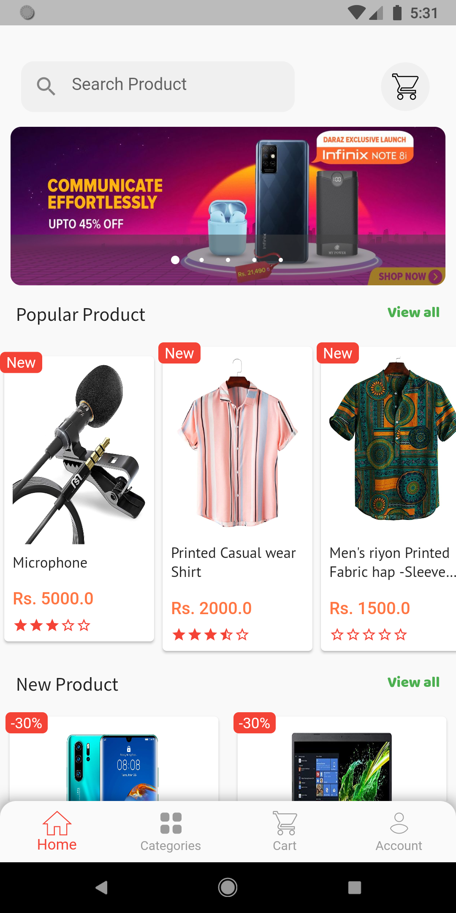
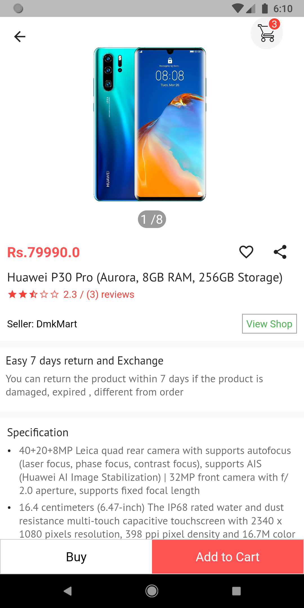
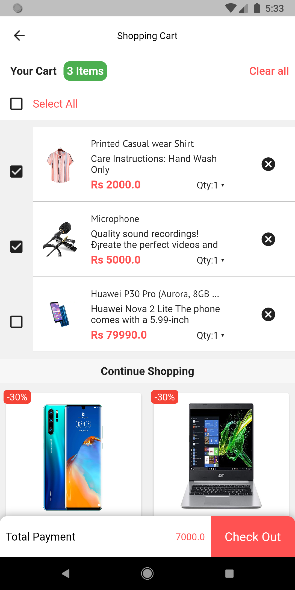
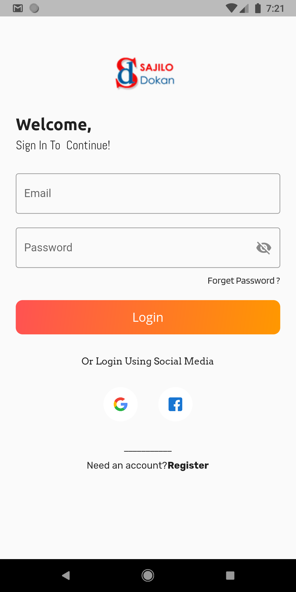
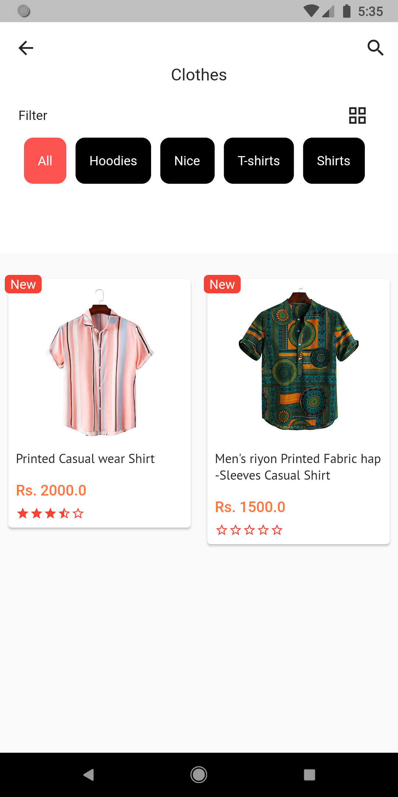
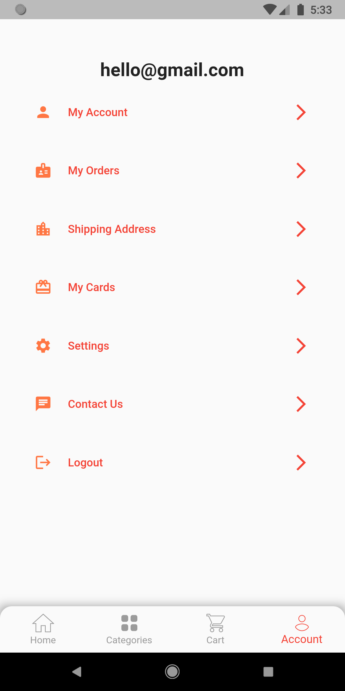

# Flutter Ecommerce App
Flutter Ecommerce App with backend Django Rest Framework \
Using GetX State Management

## Features
- Register
- Login
- Social login(google / facebook)
- Forget password / Set new password
- Add product to cart
- Delete product from cart
- Make product Favorite
- Logout

## Android Screenshots


  HomePage                 |   Product Detail Page        |  Cart Page
:-------------------------:|:-------------------------:|:-------------------------:
||

  Login                    |   Category-type              |  Account
:-------------------------:|:-------------------------:|:-------------------------:
||


## Directory Tree
```
├───lib
│   ├───bindings
│   ├───config
│   ├───data
│   │   └───datasource
│   ├───domain
│   │   ├───exception
│   │   ├───model
│   │   ├───repository
│   │   ├───request
│   │   └───response
│   ├───package
│   └───presentation
│       ├───pages
│       │   ├───account
│       │   │   └───views
│       │   ├───cart
│       │   │   └───views
│       │   ├───Category
│       │   │   └───views
│       │   ├───details
│       │   │   └───view
│       │   ├───forgot-password
│       │   ├───home
│       │   │   └───views
│       │   ├───landing_home
│       │   ├───login
│       │   │   └───views
│       │   └───splash
│       ├───product
│       ├───routes
│       └───widgets
├───screenshots
```
